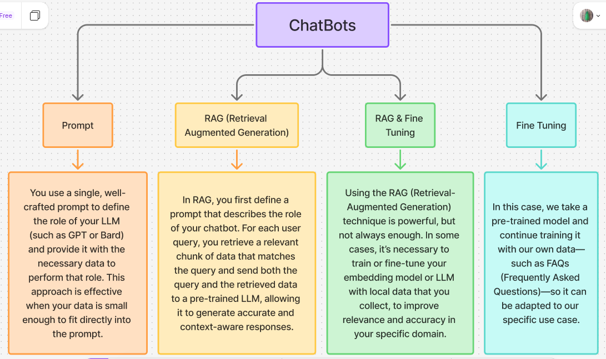

# Chatbots
### definition :
<h4>A chatbot is a computer program that simulates human conversation with an end user. Not all chatbots are equipped with artificial intelligence (AI), but modern chatbots increasingly use conversational AI techniques such as natural language processing (NLP) to understand user questions and automate responses to them.
The next generation of chatbots with generative AI capabilities will offer even more enhanced functionality with their understanding of common language and complex queries, their ability to adapt to a user’s style of conversation and use of empathy when answering users’ questions. Business leaders can clearly see this future: 85% of execs say generative AI will be interacting directly with customers in the next two years. An enterprise-grade artificial intelligence solution can empower companies to automate self-service and accelerate the development of exceptional user experiences.</h4>

### check this articel for more information [ibm-chatbot](https://www.ibm.com/think/topics/chatbots)

## types of chatbots that use llm (large language models)

