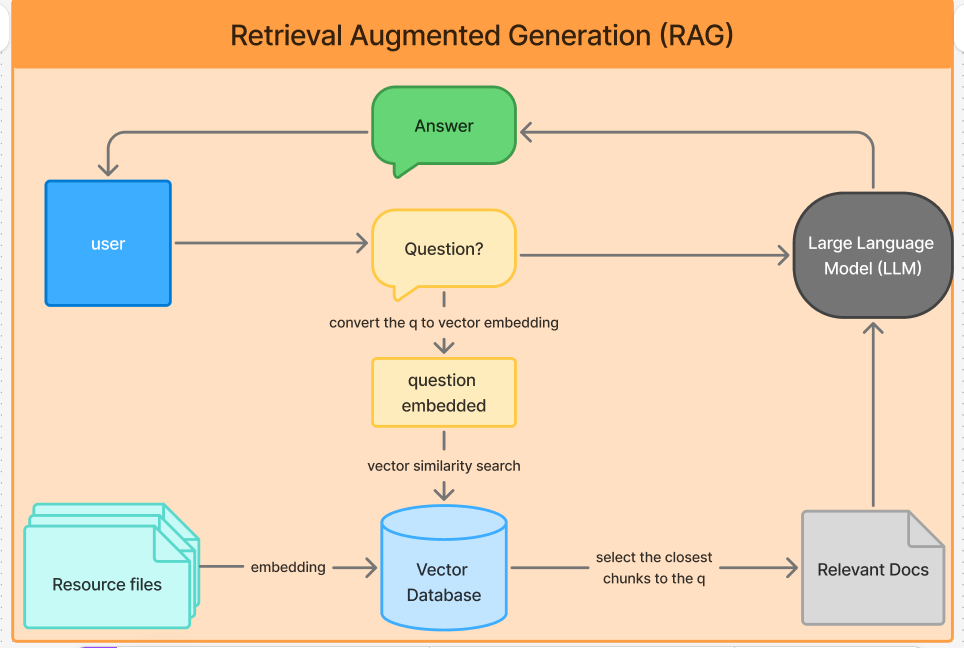
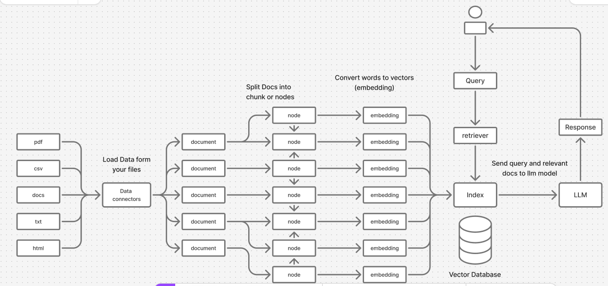

# RAG with Lama-Index

## simple graph to explain how RAG is work

## lama-index

---
## Steps to create a agents with llama-index

- ### Load the data files
- ### Split the loaded data into a nodes
- ### Indexing the data and store it
- ### Load the indexed data from storage
- ### Use Groq as a chatbot:
    - #### take the query and relevant docs
    - #### answering the query base on relevant docs

