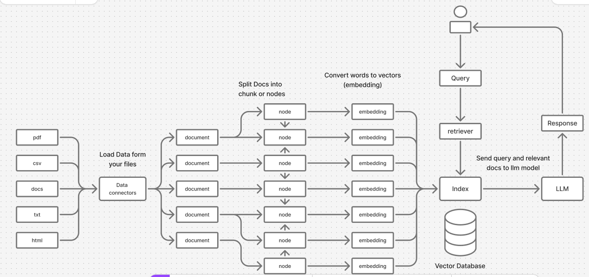

# LLama-index Workflow

### [figma-graph](https://www.figma.com/board/533aIYOxhNWqI5BFpClo90/Untitled?node-id=0-1&p=f&t=NDnDF9UzGcvaOheh-0) of llama-index workflow

## how llama-index work
- #### load your data files (csv/pdf/txt...)
- #### split your data into a nodes or chunks
- #### convert the words to vectors (embedding) collect all chunks in index (vector database)
- #### store the index in your local storage (one time)
- #### load the stored index
- #### chose llm model (openai/Claude/llama/groq) model to use it with your index
- #### use the index as retiever or chat or query enging

